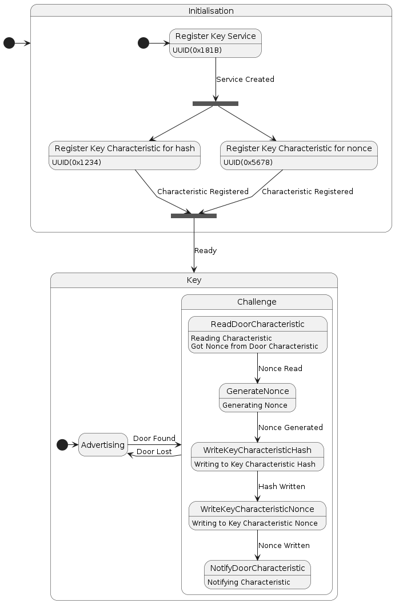

# Fonctionnement de la clé

## Description

> TODO

## Séquence de fonctionnement



# Exemple de log de la clé

```
 --- Starting advertising ---
 --- Advertising successful ---
 --- Got door service :  Service: 19 22 UUID(0x181a) ---
 --- Got door characteristic :  Characteristic: 23 21 26 UUID(0x2a6e) ---
 --- Reading to door characteristic with UUID: UUID(0x2a6e) ---
 --- Get nouce from door characteristic :  2025454 ---
 --- Writing to key characteristic hash with UUID: UUID(0x1234) ---
 --- Writing data: b'\xc7S2\xf4\xc7Rr*p\x99\x01\xa0A\xe14\x08\xaa\x1e>.' ---
 --- Writing to key characteristic nounce with UUID: UUID(0x5678) ---
 --- Writing data: 76471665 ---
 --- Notifying characteristic ---
 --- Sleeping ---
```
