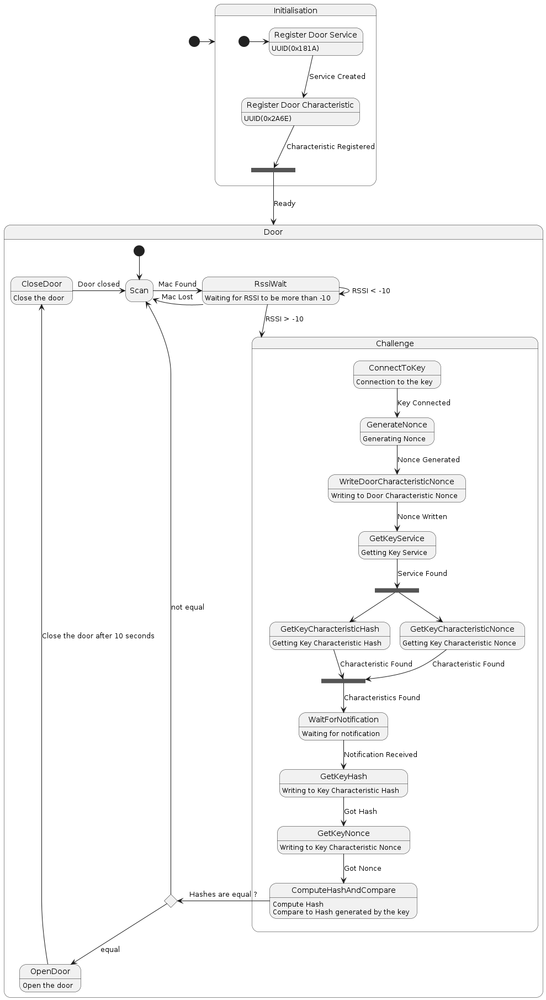

# Fonctionnement de la porte

## Description

> TODO

## Séquence de fonctionnement



# Exemple de log de la porte

```
Rssi of 7c:df:a1:e8:8c:aa : -10
Rssi of 7c:df:a1:e8:8c:aa : -10
Rssi of 7c:df:a1:e8:8c:aa : -9
 --- Device 7c:df:a1:e8:8c:aa is in range ---
 --- Starting challenge ---
 --- Generated nonce1 :  2622575 ---
 --- Waiting for response ---
 --- Got hash response :  b'\xc7|\xb7\xe9\t\x14\xb5\xeaa\x0b\xbb\xa5"6\xae#\xdb\xdcl ' ---
 --- Got nonce2 :  27091560 ---
 --- Generated hash :  b'\xc7|\xb7\xe9\t\x14\xb5\xeaa\x0b\xbb\xa5"6\xae#\xdb\xdcl ' ---
 --- Challenge successful ---
 --- Door Unlocked ---
 --- Door Locked ---
Rssi of 7c:df:a1:e8:8c:aa : -21
Rssi of 7c:df:a1:e8:8c:aa : -21
```
